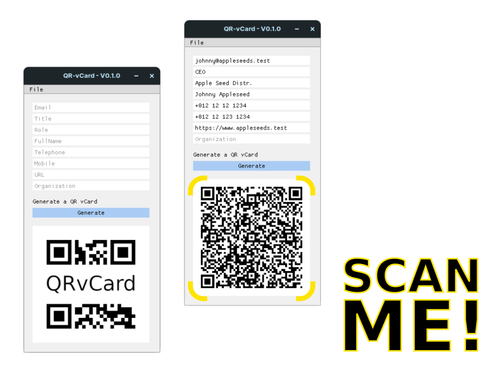

# QR-vCard

<div align="center">

</div>

### __Summary__

For my **CS50P** [Final Project](https://cs50.harvard.edu/python/2022/project/), I decided to create a single purpose, cross-platform desktop application with a functional GUI that generates vCards in QR code format.

### __Video Demo__

[Video Demo Link](https://youtu.be/33GYi6om1kI)

### __Description__

This is a single purpose desktop application that allows a user to enter contact details into a GUI that then generates a quick response code image. These QR code images can be scanned by most modern mobile devices that have a camera. QR code images allow for the ability to embed contact details on business cards, resumes, or even artwork.

The reason I chose this project was to learn how to create micro-applications for niche use-cases, and in turn learn more lightweight ways of presenting code functionality to end-users in non-technical settings. My reasoning being that good programmers should be able to help non-programmers solve problems by creating tools that simplify tasks and processes.

</br>
<hr>
</br>

### __Setup__

Make use of this one-liner for a quick setup.

```bash
git clone https://github.com/m-spangenberg/qr-vcard-generator && cd qr-vcard-generator/ && make init
```

Or, if you don't have `build-essential` installed, use `pipenv` to set up dependencies in order for the application to function.

```bash
# clone the repository
git clone https://github.com/m-spangenberg/qr-vcard-generator

# move into the cloned repo
cd qr-vcard-generator/

# make sure to have pipenv installed
pip install pipenv

# set up venv and install dependencies with pipenv
pipenv sync

# run the application
pipenv run python3 project.py
```

</br>
<hr>
</br>

### __vCard Format__

The vCard, or otherwise known as the VCF (Virtual Contact File) format is essentially a container format for contact information that can be shared between electronic devices, notably mobile phones.

With every entry on a new line, the `.vcf` format must always begin with `BEGIN:VCARD`, followed immediately by the version identifier `VERSION:4.0`, and must end with `END:VCARD`.

#### Example layout

```bash
BEGIN:VCARD
VERSION:4.0
KIND:individual
EMAIL;TYPE=work:j.appleseed@acmeappleco.bar
EMAIL;TYPE=work:j.appleseed@foo.bar
TITLE:Apple Seed Distributor
ROLE:Project Leader
FN:Johnny Appleseed
BDAY:19850412
ADR;TYPE=HOME:pobox;ext;street;locality;region;code;country
TEL;TYPE=CELL:+123 12 123 1234
TEL;TYPE=WORK:+123 12 12 1234
TEL;TYPE=HOME:+123 12 12 1234
TEL;TYPE=FAX:+123 12 12 1234
URL: https://www.example.com
TZ: Africa/Windhoek
ORG: ACME Apple Co. - Will take precedence over Full Name.
NOTE: optional note, keep it short
END:VCARD
```

</br>
<hr>
</br>

### __Testing and Development Dependencies__

To set up a development environment for this project with `pipenv`:

``` bash
make dev
```

To perform unittests with `pytest`:

``` bash
make tested
```

Or, if you don't have `build-essential` installed.

```bash
# install development dependencies
pipenv install --dev

# perform unittest
pipenv run pytest
```

</br>
<hr>
</br>

### __Acknowledgements__

Thank you to David Malan and his entire team for helping to make Harvard's CS50 accessible to anyone who wants to learn.

#### __Easter Egg__

If you generate an image without entering any information, you'll receive a QR code that points to Rick Astley's "Never Gonna Give You Up".


#### __Further Reading__

If you intend to fork this project, see the following links for helpful information on vCards.

* [Internet Engineering Task Force](https://datatracker.ietf.org/doc/html/rfc6350) - Format Specification
* [World Wide Web Consortium](https://www.w3.org/2002/12/cal/vcard-notes.html) - Format Notes
* [Wikipedia](https://en.wikipedia.org/wiki/VCard) - vCards

#### __Libraries Used__

The following libraries and tools are used to make this project.

* [qrcode](https://pypi.org/project/qrcode/) - Generating QR codes
* [Pillow](https://pypi.org/project/Pillow/) - Image formatting support
* [DearPyGui](https://pypi.org/project/dearpygui/) - Cross-platform GUI framework
* [DearPyGui-Ext](https://pypi.org/project/dearpygui-ext/) - Bundled light theme for DearPyGui